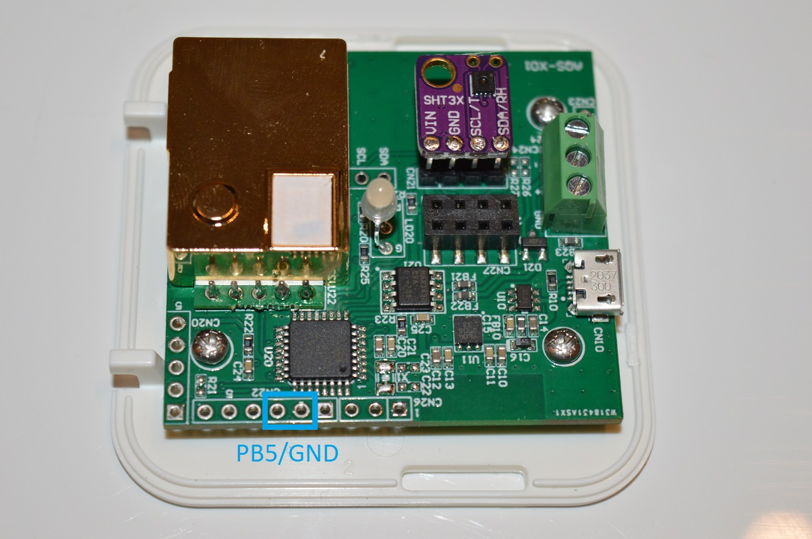

# Manual Calibration procedure

## Perform manual calibration

1) Expose sensor to fresh air for minimum 20 minutes

2) Connect PB5 to ground until the central LED (AQS indicator) switches off and then release PB5

3) Automatic calibration is Off, perform manual calibrations regularly (check sensor manufacturer datasheet)

## Re-enable self-calibration (ABC on)

1) If you want to have a calibrated sensor during the first 24h expose sensor to fresh air for minimum 20 minutes. This is because to enable ABC calibration a manual calibration is done first

2) Connect PB5 to ground until the central LED (AQS indicator) switches off - DON'T release PB5 yet, keep holding until the LED will flash quickly,  then release PB5

3) Automatic calibration is On, expose the sensor to fresh air during 20 minutes every day (24h)

## Locating PB5 and GND

