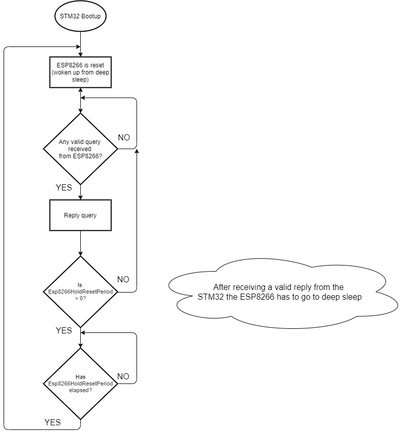

# AQS-X01 communications with ESP8266-01

## Serial Port

The AQS-X01 communicates with the ESP8266 using a UART port. 

In the binaries provided the serial port is configured as follows:

- Baudrate:115200 bits/s
- 8 data bits 
- 1 Stop bit
- No Parity
- The timeout has been set to 50ms

```
Serial.begin(115200);
Serial.setTimeout(50);
```

## Serial Protocol

The serial protocol used has been Modbus RTU. The CRC is calculated following the Modbus RTU protocol and the device address is ignored at both ends for addressing but still included in the CRC calculation. 

## Power Consumption

The ESP8266 is quite power hungry and even if the current consumed it can be provided for the regulator on board, with the ESP8266 running constantly the board heats up several degrees Celsius making it more difficult to have a reliable temperature reading (and humidity in consequence).

Note: If measuring temperature/humidity is not a concern for you there is no need to put the ESP to sleep.

It is recommended to put the ESP8266 in deep sleep and let the AQS-X01 to wake it up when required following the following flow diagram:




The woken up period can be edited using a Modbus register - Esp8266HoldResetPeriod

