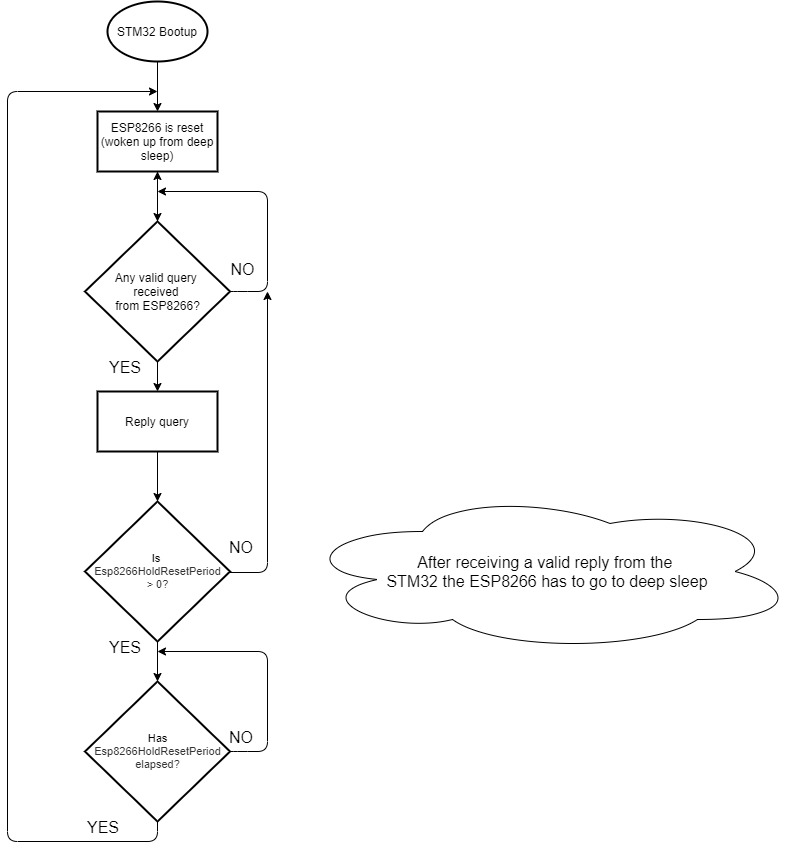

# AQS-X01 communications with ESP8266-01

## Build and flash from VS Code

This repository is configured for an **ESP8266 ESP-01 with 1 MB flash** using
PlatformIO. Install the recommended `PlatformIO IDE` extension when VS Code
prompts you, then edit the local settings files before building:

- `Examples/mqtt/credentials.h` (ignored by Git) and `Examples/mqtt/mqtt.h`
- `Examples/remote_DO/credentials.h` (ignored by Git)
- `Examples/wifi_portal_mqtt/mqtt_config.h` (ignored by Git; copy
  `mqtt_config_template.h` on a clean clone)

In VS Code, open the **Extensions** view, install **PlatformIO IDE**, restart
VS Code when requested, and allow PlatformIO to finish installing its toolchain.
Open the repository root rather than an individual example directory.

The configured target is an ESP-01 with 1 MB flash (`board = esp01_1m`). For an
older 512 KB module, change that line in `platformio.ini` to `board = esp01`.

Open **Terminal > Run Task** and choose one of the `ESP-01` tasks. The build
outputs are:

- MQTT: `.pio/build/mqtt/firmware.bin`
- Remote DO: `.pio/build/remote_do/firmware.bin`
- Wi-Fi portal MQTT: `.pio/build/wifi_portal_mqtt/firmware.bin`

The equivalent terminal commands are:

```bash
pio run -e mqtt
pio run -e remote_do
pio run -e wifi_portal_mqtt
```

Build and upload the Wi-Fi portal firmware in one command with:

```bash
pio run -e wifi_portal_mqtt -t upload
```

PlatformIO normally detects the USB serial adapter automatically. If more than
one serial device is attached, add its path (for example `/dev/ttyUSB0`) to the
selected environment in `platformio.ini`:

```ini
upload_port = /dev/ttyUSB0
monitor_port = /dev/ttyUSB0
```

List detected ports with:

```bash
pio device list
```

On Linux, `/dev/ttyUSB0` is normally owned by the `dialout` group. If upload
fails with `Permission denied`, add your user to that group:

```bash
sudo usermod -aG dialout "$USER"
```

Then fully log out of the desktop and log back in (or reboot), reopen VS Code,
and verify that `id` lists `dialout`. Restarting only the terminal may leave
VS Code with the old group membership.

### ESP-01 programming wiring

Use a **3.3 V USB-to-UART adapter and a stable 3.3 V supply**; never apply 5 V
to an ESP-01 pin. The supply should comfortably handle Wi-Fi current peaks.

| ESP-01 pin | Programmer connection |
|---|---|
| VCC | Regulated 3.3 V |
| GND | GND |
| EN / CH_PD | 3.3 V (preferably through 10 kOhm) |
| TX | Adapter RX |
| RX | Adapter TX (3.3 V logic) |
| GPIO0 | GND only while entering flash mode |
| GPIO2 | 3.3 V / leave pulled high |
| RST | Briefly pull low to reset |

To flash: disconnect the ESP-01 from the AQS-X01 UART, pull GPIO0 low, reset or
power-cycle it, and run a `Flash` task. After upload, release GPIO0 and reset
again to boot the program. A socket-style ESP-01 programmer with a PROG/RUN
switch handles these boot straps for you.

## Wi-Fi setup portal MQTT example

`Examples/wifi_portal_mqtt` starts a password-protected setup access point when
no valid Wi-Fi credentials are stored, or whenever the saved network cannot be
reached within 20 seconds. Connect a phone or computer to:

- Network: `AQS-X01-Setup-<chip-id>`
- Password: `configureme`
- Page: `http://192.168.4.1/`

Enter the target network SSID and password and press **Test and save
connection**. The ESP-01 tests the connection before writing the credentials to
EEPROM. On success it restarts in station mode and runs the MQTT/AQS publishing
loop. The page scans nearby 2.4 GHz networks and displays them in a dropdown;
hidden SSIDs can still be entered manually. Edit the ignored local file
`Examples/wifi_portal_mqtt/mqtt_config.h`
before building to set the broker, login, client ID, and topics. A clean clone
can create it by copying `mqtt_config_template.h`.

After publishing one valid AQS reading to MQTT, the ESP-01 calls
`ESP.deepSleep(0)` and sleeps indefinitely. The AQS-X01 must wake it through the
RESET pin, as in the original MQTT example.

To change Wi-Fi while valid credentials are already stored, use a **double
reset**: pulse RESET once, then pulse it again during the 2.5-second startup
window. The second boot opens the setup AP without erasing the old credentials.
This distinguishes an intentional configuration request from the single RESET
pulse used by the AQS-X01 to wake the ESP. Press **Forget saved Wi-Fi** on the
page to erase the saved credentials. If the saved network can no longer be
reached, a single wake automatically opens the setup AP after the 20-second
connection timeout.

### Local MQTT broker and message test

Mosquitto can run on the same PC used to build the firmware. On Debian/Ubuntu,
install its broker and clients with:

```bash
sudo apt install mosquitto mosquitto-clients
sudo systemctl enable --now mosquitto
```

Set `MQTT_SERVER` in `mqtt_config.h` to the PC's LAN address on the same network
as the ESP-01, not to `localhost` or `127.0.0.1`. Find candidate addresses with
`hostname -I`. Port `1883` must be reachable from the ESP network, and the
Mosquitto listener/authentication configuration must match `MQTT_USER` and
`MQTT_PASSWORD`.

Subscribe to the example's three topics on the broker PC with:

```bash
mosquitto_sub -h 127.0.0.1 -p 1883 \
  -t 'example@gmail.com/co2' \
  -t 'example@gmail.com/temperature' \
  -t 'example@gmail.com/humidity' -v
```

Change those topic strings to match `mqtt_config.h`. The firmware publishes
retained messages, so the most recent successful values are delivered to new
subscribers.

## Serial Port

The AQS-X01 communicates with the ESP8266 using a UART port.

In the binaries provided the serial port is configured as follows:

- Baudrate:115200 bits/s
- 8 data bits
- 1 Stop bit
- No Parity
- The timeout has been set to 50ms

```
Serial.begin(115200);
Serial.setTimeout(50);
```

## Serial Protocol

The serial protocol used has been Modbus RTU. The CRC is calculated following the Modbus RTU protocol and the device address is ignored at both ends for addressing but still included in the CRC calculation.

## Power Consumption

The ESP8266 is quite power hungry and even if the current consumed it can be provided for the regulator on board, with the ESP8266 running constantly the board heats up several degrees Celsius making it more difficult to have a reliable temperature reading (and humidity in consequence).

Note: If measuring temperature/humidity is not a concern for you there is no need to put the ESP to sleep.

It is recommended to put the ESP8266 in deep sleep and let the AQS-X01 to wake it up when required following the following flow diagram:




The woken up period can be edited using a Modbus register - Esp8266HoldResetPeriod
